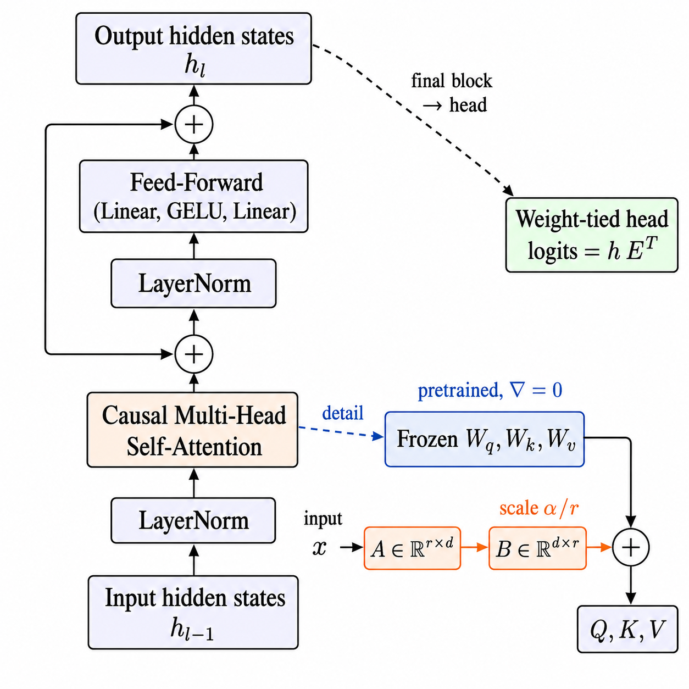
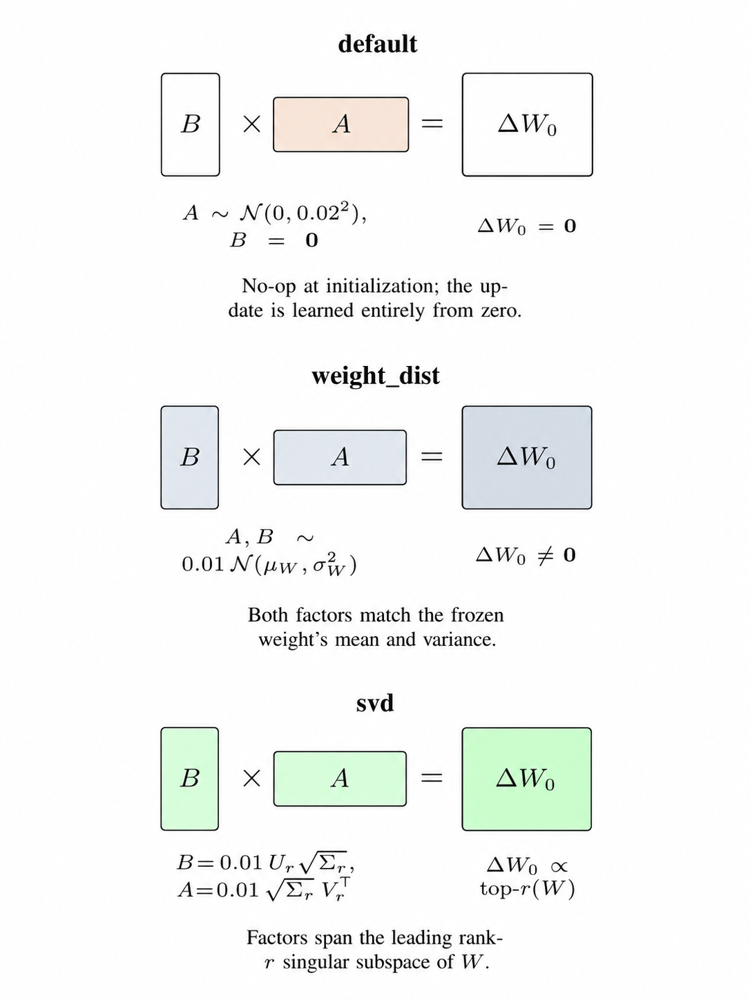
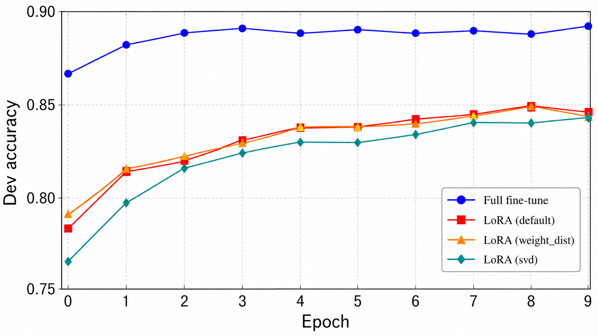

# The Effect of LoRA Initialization on Parameter-Efficient GPT-2 Fine-Tuning
Keywords: LoRA, Parameter-Efficient Fine-Tuning, GPT-2, Initialization Strategies, AdamW, Low-Resource Generation
if you want more information, you can check article.

📄 **Full Report:** [Open Article](Documents/The%20Effect%20of%20LoRA%20Initialization%20on%20Parameter-Efficient%20GPT-2%20Fine-Tuning.pdf)

## 1. Project Overview

This project investigates how different **LoRA initialization strategies** affect parameter-efficient fine-tuning of GPT-2. The main objective is to determine whether the initial distribution of LoRA parameters can influence downstream performance while preserving the computational advantages of PEFT.



The experimental pipeline uses a **from-scratch GPT-2 implementation** together with a custom **AdamW optimizer**. Official pretrained GPT-2 weights are transferred into the implementation and validated against reference implementations before downstream experiments are performed.

Three LoRA initialization strategies are compared:



- **Default:** one LoRA factor is randomly initialized while the other starts at zero, producing an initial zero update.
- **Weight-distribution:** LoRA factors are initialized using statistics derived from the corresponding pretrained weight matrix.
- **SVD:** LoRA factors are initialized from a truncated singular value decomposition of the pretrained weight matrix.

The study evaluates these strategies across three downstream settings:

1. **Sentiment classification** using SST and CFIMDB.
2. **Paraphrase detection** using Quora question pairs.
3. **Low-resource text generation** using Shakespearean sonnets.

The main finding is that the effect of initialization is **task-dependent**. On Quora paraphrase detection, the three LoRA variants converge to very similar accuracy values. In contrast, sonnet generation shows a clearer separation between initialization strategies, with **weight-distribution initialization producing the strongest LoRA result**.

LoRA also provides a strong parameter-efficiency trade-off. The LoRA configurations train only about **0.44M parameters (0.36% of GPT-2)** compared with **124.44M parameters** for full fine-tuning, while the best LoRA configuration retains **97.9% of full fine-tuning chrF performance**.

---

## 4. Sonnet Generation Results

| Adaptation Method | Trainable Parameters | Trainable % | chrF | BLEU |
|---|---:|---:|---:|---:|
| Full fine-tune | 124.44 M | 100.00% | **40.95** | **23.75** |
| Last-layer | 7.09 M | 5.70% | 36.11 | 21.58 |
| LoRA (default) | 0.44 M | 0.36% | 39.29 | 23.07 |
| **LoRA (weight_dist)** | **0.44 M** | **0.36%** | **40.09** | **23.54** |
| LoRA (svd) | 0.44 M | 0.36% | 39.13 | 23.10 |

The weight-distribution initialization achieves the best LoRA generation quality, approaching full fine-tuning while updating only a very small fraction of the model.

---

## 5. chrF and BLEU Learning



The **weight_dist LoRA** initialization strategy demonstrated more consistent and effective performance than the other LoRA initialization methods. In particular, weight_dist LoRA achieved results close to those obtained with last-layer fine-tuning while requiring substantially fewer trainable parameters. However, on other downstream tasks, the differences among LoRA initialization strategies were relatively small, suggesting that model performance is not always highly sensitive to the choice of LoRA initialization. **But importantly, weight_dist LoRA did not exhibit any noticeable performance degradation in these tasks, which further supports its selection as the preferred initialization strategy.**

---

## 6. Key Takeaway

The experiments suggest that LoRA initialization should not be treated as a purely implementation-level choice. Different initialization distributions may lead to nearly identical results on large-data classification tasks, but a pretrained-weight-aware initialization can provide a measurable advantage in low-resource generation. This makes initialization strategy an important design consideration when adapting language models under limited parameter, storage, and hardware budgets.

---

## 2. Project Structure

This section shows where each important file lives and what it is used for.

```text
ceng534/
|-- classifier.py
|-- paraphrase_detection.py
|-- sonnet_generation.py
|-- _PROJECT_STRUCTURE.md
|-- _RUN_COMMANDS.md
|-- data/
|-- predictions/
|-- results/
|-- scripts/
|-- src/
`-- others/
```

### 2.1 Root Files

```text
ceng534/
|-- classifier.py
|-- paraphrase_detection.py
|-- sonnet_generation.py
|-- _PROJECT_STRUCTURE.md
`-- _RUN_COMMANDS.md
```

- `classifier.py`: Main script for sentiment classification on SST and CFIMDB.
- `paraphrase_detection.py`: Main script for Quora paraphrase detection.
- `sonnet_generation.py`: Main script for GPT-2 sonnet generation.
- `_PROJECT_STRUCTURE.md`: Standalone project-layout reference.
- `_RUN_COMMANDS.md`: Standalone copy-ready command reference.

### 2.2 Source Code

```text
src/
|-- __init__.py
|-- config.py
|-- datasets.py
|-- distribution_metrics.py
|-- evaluation.py
|-- log_experiments.py
|-- lora_attention.py
|-- optimizer.py
|-- utils.py
|-- models/
|   |-- __init__.py
|   |-- base_gpt.py
|   `-- gpt2.py
`-- modules/
    |-- __init__.py
    |-- attention.py
    `-- gpt2_layer.py
```

- `src/config.py`: GPT-2 configuration classes.
- `src/datasets.py`: Dataset loaders and batching logic.
- `src/distribution_metrics.py`: Estimates weight distribution names such as `normal-like`, `uniform-like`, or `zero-like`.
- `src/evaluation.py`: Evaluation functions for paraphrase detection and sonnet generation.
- `src/log_experiments.py`: Writes experiment metrics to CSV files in `results/`.
- `src/lora_attention.py`: Prints aggregated Attention, LoRA-A, and LoRA-B weight statistics.
- `src/optimizer.py`: Custom AdamW optimizer.
- `src/utils.py`: Shared helper functions.
- `src/models/base_gpt.py`: Base pretrained model helper class.
- `src/models/gpt2.py`: Main GPT-2 model implementation.
- `src/modules/attention.py`: Causal self-attention and LoRA adapter logic.
- `src/modules/gpt2_layer.py`: One GPT-2 transformer block.

### 2.3 Data

```text
data/
|-- ids-cfimdb-dev.csv
|-- ids-cfimdb-test-student.csv
|-- ids-cfimdb-train.csv
|-- ids-sst-dev.csv
|-- ids-sst-test-student.csv
|-- ids-sst-train.csv
|-- quora-dev.csv
|-- quora-test-student.csv
|-- quora-train.csv
|-- sonnets.txt
|-- sonnets_held_out.txt
|-- sonnets_held_out_dev.txt
`-- TRUE_sonnets_held_out_dev.txt
```

- `ids-sst-*`: SST sentiment classification data.
- `ids-cfimdb-*`: CFIMDB sentiment classification data.
- `quora-*`: Quora paraphrase detection data.
- `sonnets*`: Sonnet training and held-out generation data.
- `TRUE_sonnets_held_out_dev.txt`: Gold sonnets for chrF/BLEU evaluation.

### 2.4 Outputs

```text
predictions/
|-- generated_sonnets.txt
|-- para-dev-output.csv
|-- para-test-output.csv
|-- last-linear-layer-*-out.csv
`-- full-model-*-out.csv

results/
|-- sonnet_generation.csv
|-- generate_figures.py
|-- figures/
|   `-- generated .png figures
|-- summaries/
|   `-- generated summary .csv files
|-- sonnet_generation_checkpoints/
|   `-- ...
`-- other result text/csv files
```

- `predictions/`: Submission-style output files.
- `results/`: Logs, metric files, and saved checkpoints.
- `results/generate_figures.py`: Reads result CSV files and generates task-specific figures.
- `results/figures/`: Generated `.png` figures.
- `results/summaries/`: Generated summary CSV files by task.
- `results/sonnet_generation_checkpoints/`: Sonnet `.pt` checkpoints grouped by run settings.

### 2.5 Helper Scripts

```text
scripts/
|-- optimizer_test.py
|-- optimizer_test.npy
|-- prepare_submit.py
|-- sanity_check.py
`-- test_lora_init.py
```

- `scripts/optimizer_test.py`: Tests `src/optimizer.py`.
- `scripts/optimizer_test.npy`: Reference tensor for optimizer testing.
- `scripts/prepare_submit.py`: Creates the submission zip.
- `scripts/sanity_check.py`: Checks local GPT-2 output against Hugging Face GPT-2.
- `scripts/test_lora_init.py`: Demonstrates LoRA initialization methods.

### 2.6 Other Files

```text
others/
|-- env.yml
|-- LICENSE
|-- README.md
`-- setup.sh
```

- `others/env.yml`: Conda environment file.
- `others/LICENSE`: License file.
- `others/README.md`: Original project README.
- `others/setup.sh`: Setup helper.

---

## 3. Run Commands

Run the commands below from the project root.

```powershell
cd C:\Users\Victus\Desktop\ceng534
```

### 3.1 Sonnet Generation

Full fine-tuning on GPU:

```powershell
python sonnet_generation.py --use_gpu --fine_tune_mode full --epochs 10 --batch_size 8 --lr 1e-5
```

Last-layer fine-tuning on GPU:

```powershell
python sonnet_generation.py --use_gpu --fine_tune_mode last-layer --epochs 10 --batch_size 8 --lr 1e-5
```

LoRA fine-tuning on GPU:

```powershell
python sonnet_generation.py --use_gpu --fine_tune_mode lora --lora_r 8 --lora_alpha 16 --lora_init_method default --epochs 10 --batch_size 8 --lr 1e-5
```

LoRA with weight-distribution initialization:

```powershell
python sonnet_generation.py --use_gpu --fine_tune_mode lora --lora_r 8 --lora_alpha 16 --lora_init_method weight_dist --epochs 10 --batch_size 8 --lr 1e-5
```

LoRA with SVD initialization:

```powershell
python sonnet_generation.py --use_gpu --fine_tune_mode lora --lora_r 8 --lora_alpha 16 --lora_init_method svd --epochs 10 --batch_size 8 --lr 1e-5
```

CPU quick run:

```powershell
python sonnet_generation.py --fine_tune_mode lora --lora_r 4 --lora_alpha 32 --epochs 1 --batch_size 2 --lr 1e-5
```

Sonnet checkpoints are saved under:

```text
results/sonnet_generation_checkpoints/
```

### 3.2 Paraphrase Detection

Full fine-tuning on GPU:

```powershell
python paraphrase_detection.py --use_gpu --fine_tune_mode full --epochs 10 --batch_size 8 --lr 1e-5
```

LoRA fine-tuning on GPU:

```powershell
python paraphrase_detection.py --use_gpu --fine_tune_mode lora --lora_r 8 --lora_alpha 16 --lora_init_method default --epochs 10 --batch_size 8 --lr 1e-5
```

LoRA with weight-distribution initialization:

```powershell
python paraphrase_detection.py --use_gpu --fine_tune_mode lora --lora_r 8 --lora_alpha 16 --lora_init_method weight_dist --epochs 10 --batch_size 8 --lr 1e-5
```

LoRA with SVD initialization:

```powershell
python paraphrase_detection.py --use_gpu --fine_tune_mode lora --lora_r 8 --lora_alpha 16 --lora_init_method svd --epochs 10 --batch_size 8 --lr 1e-5
```

CPU quick run:

```powershell
python paraphrase_detection.py --fine_tune_mode lora --lora_r 4 --lora_alpha 32 --epochs 1 --batch_size 2 --lr 1e-5
```

### 3.3 Sentiment Classification

Last-linear-layer fine-tuning on GPU:

```powershell
python classifier.py --use_gpu --fine-tune-mode last-linear-layer --epochs 10 --batch_size 8 --lr 1e-3
```

Full-model fine-tuning on GPU:

```powershell
python classifier.py --use_gpu --fine-tune-mode full-model --epochs 10 --batch_size 8 --lr 1e-5
```

CPU quick run:

```powershell
python classifier.py --fine-tune-mode last-linear-layer --epochs 1 --batch_size 2 --lr 1e-3
```

### 3.4 Useful Checks

Optimizer test:

```powershell
python scripts/optimizer_test.py
```

GPT-2 sanity check:

```powershell
python scripts/sanity_check.py
```

LoRA initialization demo:

```powershell
python scripts/test_lora_init.py
```

Prepare submission zip:

```powershell
python scripts/prepare_submit.py
```

Generate result figures:

```powershell
python results/generate_figures.py
```

---

## 7. Project Origin and Evolution

### 7.1 Original CS224N Starting Point

This project originally started from the **Stanford CS224N Default Final Project: Build GPT-2** codebase. The original assignment was organized around implementing core GPT-2 components and then applying the model to downstream NLP tasks.

The initial project requirements included completing the missing implementations in:

- `src/modules/attention.py` — causal self-attention.
- `src/modules/gpt2_layer.py` — GPT-2 transformer layer.
- `src/models/gpt2.py` — GPT-2 model implementation.
- `classifier.py` — sentiment classification pipeline.
- `src/optimizer.py` — AdamW optimizer.

The baseline implementation was validated using:

- `scripts/optimizer_test.py` for the custom optimizer.
- `scripts/sanity_check.py` for GPT-2 output validation.
- `classifier.py` for last-layer and full-model sentiment classification.
- `paraphrase_detection.py` for binary paraphrase detection.
- `sonnet_generation.py` for autoregressive sonnet generation.

The original second stage focused on downstream adaptation: detecting whether two sentences are paraphrases and generating Shakespearean sonnets. Sonnet evaluation was subsequently extended with **chrF** and **BLEU** metrics, and run-specific model checkpoints are stored under `results/sonnet_generation_checkpoints/`.

### 7.2 Extension Beyond the Original Assignment

After completing the original CS224N implementation and validation requirements, the project was extended beyond the baseline assignment. The main research extension became the investigation of **LoRA initialization strategies for parameter-efficient GPT-2 fine-tuning**.

The extended version introduces:

- LoRA-based parameter-efficient fine-tuning.
- Three LoRA initialization strategies: `default`, `weight_dist`, and `svd`.
- Weight-distribution analysis for pretrained and LoRA parameters.
- Full fine-tuning, last-layer fine-tuning, and LoRA comparisons.
- chrF and BLEU evaluation for sonnet generation.
- Experiment logging, summaries, figures, and run-specific checkpoints.
- Parameter-efficiency analysis across downstream tasks.

### 7.3 End-to-End Restructuring

Following completion of the original project tasks, the codebase was **substantially restructured and extended end-to-end** rather than being used only in its original assignment form. The project structure, training workflow, evaluation pipeline, experiment organization, and model adaptation architecture were reorganized to support controlled LoRA experiments and reproducible comparisons.

As a result, the current repository should be viewed as an **extended research implementation built on top of the CS224N GPT-2 project**, not simply as the original course submission. The original codebase provided the starting point, while the current structure and experimental architecture were redesigned around parameter-efficient fine-tuning, LoRA initialization, evaluation, logging, and comparative analysis.

### 7.4 Original Project Acknowledgement

The starting codebase is adapted from the Stanford **CS224N Default Final Project**. The original project also references the prior CS224N **Implement BERT** assignment and uses components inspired by the Hugging Face `transformers` library under the Apache License 2.0.

Training hyperparameters, especially batch size, should be adjusted according to available GPU memory to avoid out-of-memory errors.
